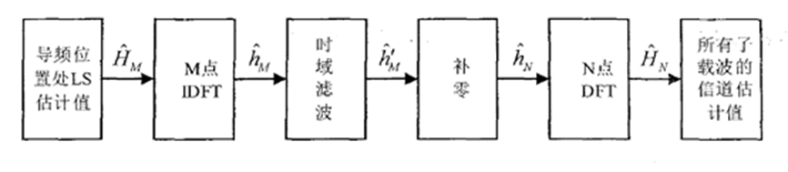
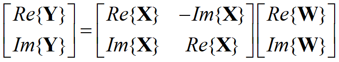
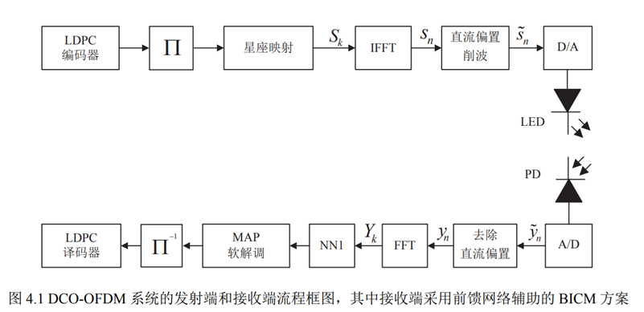
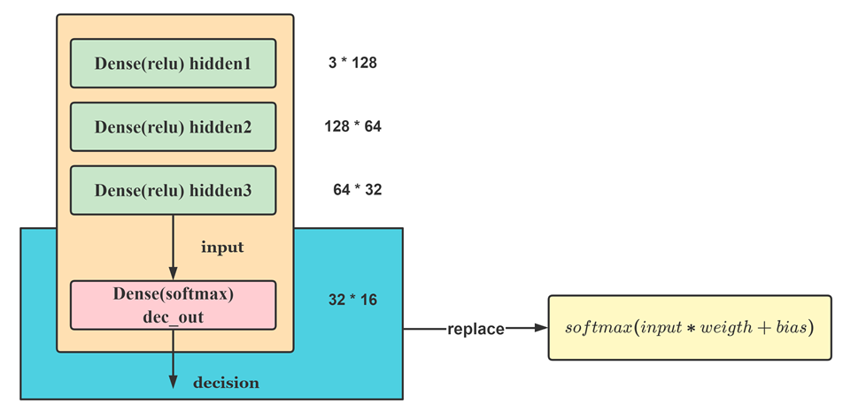
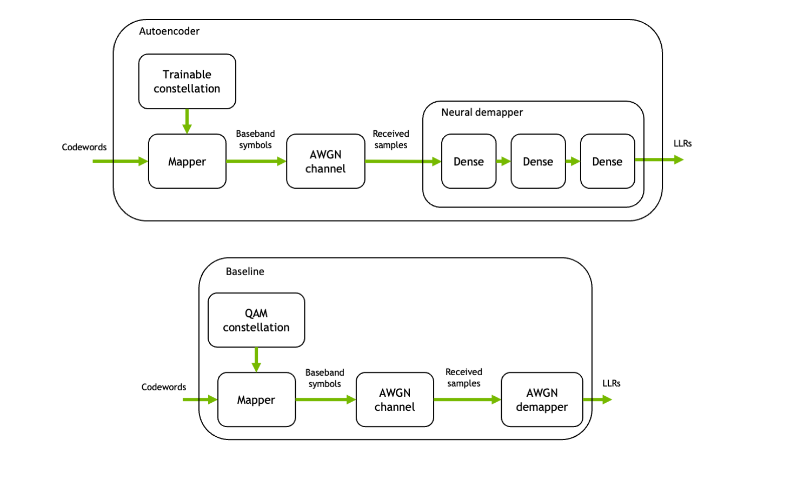

# MADDNESS

#### 介绍

本项目是[bolt](https://github.com/dblalock/bolt)项目中的MADDNESS算法的开源工程，经过了调整和测试。项目只包含MADDNESS算法Python的精确度测试部分，不包括CPP部分的时间测试。如有需要自行使用原项目程序调试即可。

#### Ubuntu 上安装教程

```bash
cd bolt # 进入项目路径
git submodule update --init # 下载子模块 kmc2（github源）
conda create -n bolt --file ./requirements.txt python=3.10 # 新建虚拟环境
conda activate bolt # 启用虚拟环境
conda install cudatoolkit=11.3 torch # 安装 cuda 和 Pytorch
pip3 install ./third_party/kmc2/ # 安装 kmc2
```

#### Windows 上安装教程

1. 请使用Python3.5以上版本进行使用，在Python3.8环境本例测试通过。推荐使用本地Python环境，Anaconda虚拟环境请自行寻找安装`setup.py`的包的方法

2. 推荐使用Pycharm作为你的IDE工具，根据调试提示安装缺失的包`pip install [你所需要的包]`

3. kmc2包是根据论文实现的K-means初始化算法，如果使用包管理工具 **最新的版本是无法适用于python3环境的！** ，请使用仓库[kmc2](https://gitee.com/dxone/kmc2.git)的`mneilly/cythonize`分支程序。将其下载后通过命令行

   【更新】因为管理政策，gitee现在不能保证正常访问，以下为github的原地址，自行找方法访问：https://github.com/mneilly/kmc2.git

```bash
python setup.py build
python setup.py install
```
即可安装

4.  kmc2包可能需要 `Microsoft Visual C++ 14.0`环境，可以自行在网络寻找，或向我们要求安装包

5.  数据集文件默认需要放置在`C:\\Users\\user\\Desktop\\datasets\\caltech\\101_ObjectCategories`（用户名无所谓，取的就是桌面后路径，这是caltech数据集的位置）请将数据集文件放置妥当，数据集如下：
- [Caltech-101](http://www.vision.caltech.edu/Image_Datasets/Caltech101/) - The dataset we extracted image patches from.
- [UCR Time Series Archive](https://www.cs.ucr.edu/~eamonn/time_series_data/) - The corpus we used to compare AMM methods across many datasets in a unified manner.
- [CIFAR-10 and CIFAR-100](https://www.cs.toronto.edu/~kriz/cifar.html).

部分数据集需要外网访问环境，请自行寻找方法或向我们咨询

#### 说明

本项目用于科学研究

# 测试场景说明

#### 概述

在之前的测试中我们研究了DFT和神经网络辅助MAP解码器两个场景，在代码中的入口如下：

1. 论文开源部分：论文开源代码的入口函数为`bolt-master/experiments/python/amm_main.py`，数据集读取函数`bolt-master/experiments/python/matmul_datasets.py`，数据集的位置如前所述

2. 改造部分：将预测器和预测方法抽象，放在函数`bolt-master/experiments/python/matmul.py`中，其中核心函数两个：

   -  `estFactory()`：构造一个预测器并使用训练集进行训练，返回一个预测器`est`，注意必须传入的参数为：

   ```python
   X_path="",  # 乘数矩阵X的训练集文件名
   W_path="",  # 乘数矩阵W的训练集文件名
   Y_path="",  # 乘法结果Y的训练集文件名
   dir=""      # 训练集文件的路径名（从bolt-master/experiments/assets开始计算）
   ```

#### DFT滤波场景

这个场景中使用IDFT和DFT变换滤波，提高信道估计的准确度。场景如下图所示



注意该场景下我们需要将复数矩阵更换为实数矩阵， 具体地说，需要使用如下公式：



将复数乘法通过拼接转变为实数矩阵乘法。

替换了IDFT和DFT两个数乘步骤，训练集存放在`bolt-master/experiments/assets/dft`目录中，测试中实时生成测试数据。训练集生成函数为`create_Traindata()`

给出这个场景下的训练集位置的使用例：

```python
dft_est = mm.estFactory(X_path="DFT_X.npy", W_path="DFT_W.npy", Y_path="DFT_Y.npy", dir="dft")
idft_est = mm.estFactory(X_path="IDFT_X.npy", W_path="IDFT_W.npy", Y_path="IDFT_Y.npy", dir="dft")
```

给出数据集使用例：

```bash
Xtrain:（25000*2）*（16*2）= 50000*32
Ytrain:（25000*2）*（128）= 50000*128
W:(16*2)*128 = 32*128
```

#### 神经网络辅助MAP解码器

这个场景考察的是一个神经网络的最后一层的替换方法，运用于如下场景之中：



网络结构如下：



左边的黄色线框是将最后一个全连接层替换后的替代函数，其中的矩阵乘法部分可以替换为无乘法方案。我们给出具体的代码整理：

1. 入口函数：入口函数文件为`bolt-master/experiments/python/LDPC_decoder_NET_main.py`，它只进行训练和给出最终结果的工作，之后需要将结果嵌入到网络代码中

2. 数据集：

   ```python
   训练集位置： bolt-master/experiments/assets/ldpc
   测试集位置： bolt-master/experiments/python/LDPC_decoder_NET_testdata
   ```

### 自编码器优化星座点

[NVIDIA/sionna](https://nvlabs.github.io/sionna/examples/Autoencoder.html) 自编码器样例



通过将上图中 Autoencoder 整体训练，得到优化后的星座点分布和解码器参数。

本程序将尝试替换解码器的后两层

程序中
- `baseline` 是指用方形 QAM 非神经网络解调
- `conventional` 是指用训练后的星座和神经网络进行解调
- `boltConventional` 是指用训练后的星座和用加速矩阵乘法替换后的神经网络进行解调

[NVIDIAsionna/train.py](./NVIDIAsionna/train.py) 是训练函数，需要事先运行它来训练获得网络参数并存在 `./NVIDIAsionna/awgn_autoencoder_weights_conventional_training`；
可以运行 [NVIDIAsionna/eval.py](./NVIDIAsionna/eval.py) 来进行工具集提供的测试，会绘制 BLER 曲线；
最后，运行 [boltConventional.py](./boltConventional.py) 来测试加速矩阵乘法替换后的性能，也会绘制 BLER 曲线。

使用方法：
1. `pip3 install sionna`
2. `cd experiments/python/NVIDIAsionna && python3 train.py`
3. `cd .. && python3 boltConventional.py`

